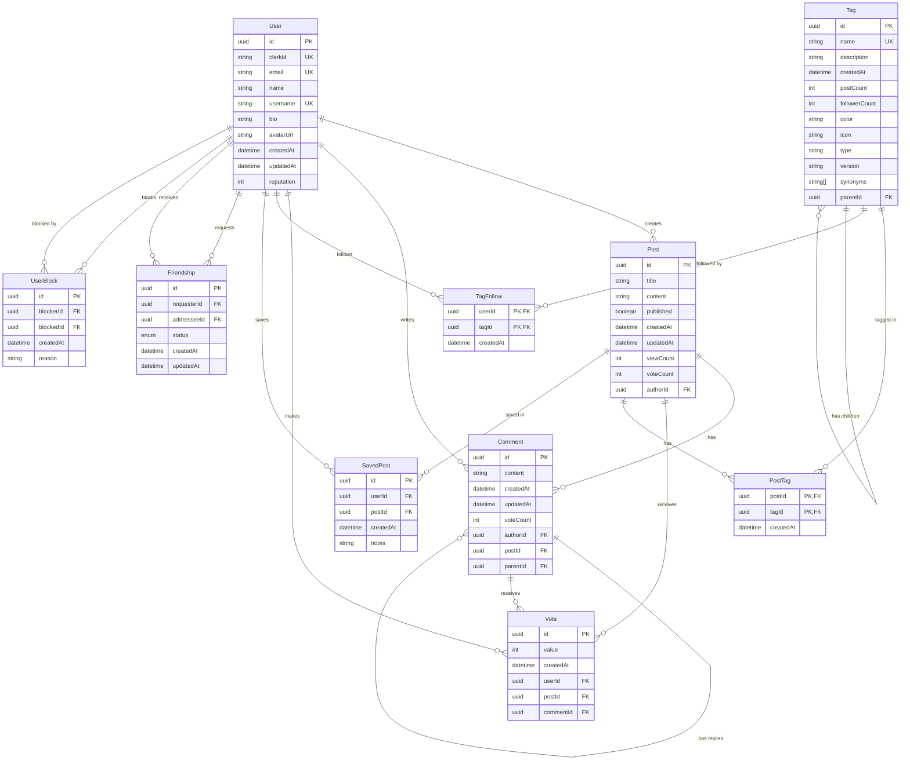

# Prompt Overflow

A forum for prompt engineers. Built with Next.js, TypeScript, React, Shadcn UI, Radix UI, Tailwind CSS.

## Features
- **UI**: Tailwind CSS, Shadcn UI, Radix UI
- **Authentication**: Clerk
- **Database**: Supabase, Prisma

## Getting Started
Clone the repository and install dependencies:

```bash
git clone https://github.com/chrisknsmn/next-template.git
cd next-template
npm install
```

### Prisma Setup
Install Prisma and the Prisma client:

Initialize Prisma:

```bash
npx prisma init
```

Set the following environment variables in your `.env` file:

```env
DATABASE_URL=your_database_url
DIRECT_URL=your_direct_url
```

Refer to the [Prisma Integration with Supabase](https://www.prisma.io/docs/guides/database/integrations/with-supabase) for more information.

### Updating the Schema
Run the initial migration after updating your schema:

```bash
npx prisma migrate dev --name init
```

### Database Schema



## Development

Start the development server:

```bash
npm run dev
```

Open [http://localhost:3000](http://localhost:3000) in your browser.

## Documentation
- [Next.js Documentation](https://nextjs.org/docs)
- [Tailwind CSS Documentation](https://tailwindcss.com/docs)
- [Supabase Documentation](https://supabase.io/docs)
- [Prisma Documentation](https://www.prisma.io/docs)
- [Clerk Documentation](https://clerk.dev/docs)
- [Stripe Documentation](https://stripe.com/docs)
- [Shadcn UI Documentation](https://shadcn.dev/docs)

## License
This project is licensed under the MIT License.
